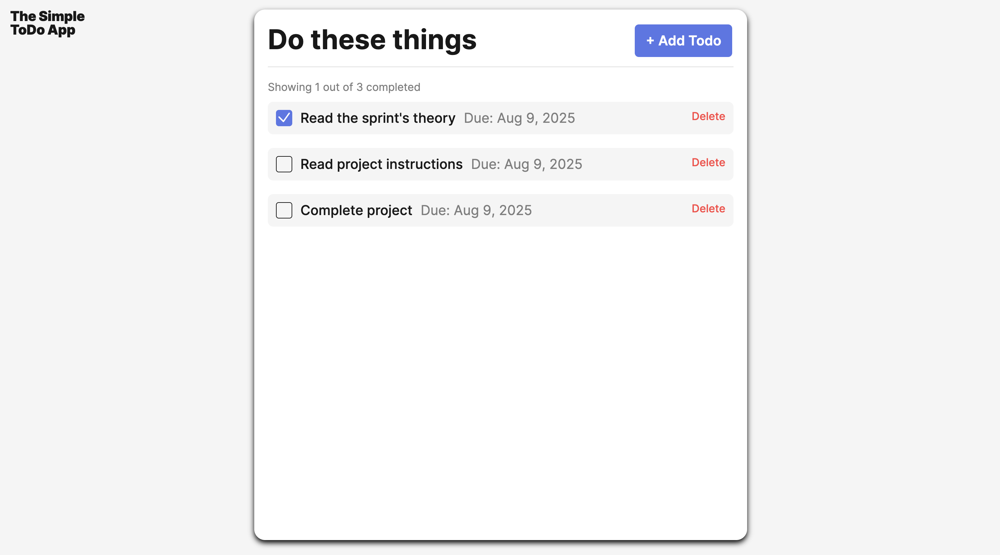
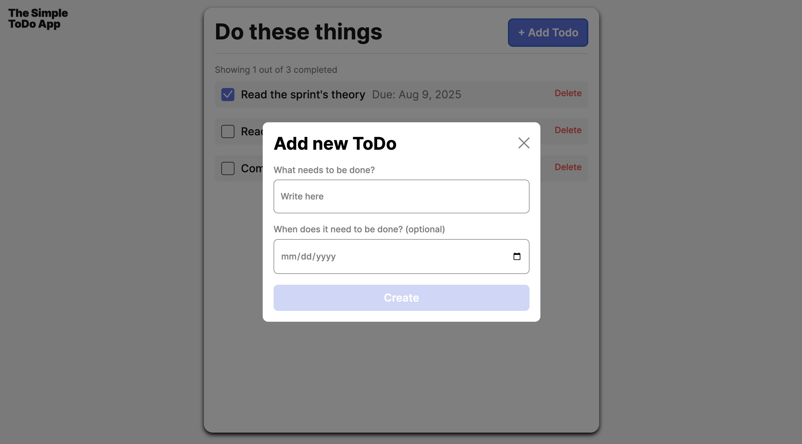

# Simple Todo App

_A clean and simple to-do list application built with object-oriented JavaScript._

---

# Table of Contents

- [Live Project](#live-project)
- [Introduction](#introduction)
- [Project Goals](#project-goals)
- [Architecture Overview](#architecture-overview)
- [What Was Done](#what-was-done)
- [Features](#features)
- [Technologies](#technologies)
- [Screenshots](#screenshots)
- [Conclusion](#conclusion)
- [Future Improvements](#future-improvements)
- [Deployment & Requirements](#deployment--requirements)
- [Development Notes](#development-notes)

---

## Live Project

**Domain:** [https://michelleoco.github.io/se_project_todo-app/](https://michelleoco.github.io/se_project_todo-app/)

---

## Introduction

**Simple Todo App** is a straightforward application that helps users track tasks and deadlines. This project demonstrates modern JavaScript development practices using ES6 modules and object-oriented programming principles to create a maintainable and scalable codebase.

---

## Project Goals

- Build a user-friendly to-do list interface
- Implement clean, modular object-oriented JavaScript architecture
- Enable adding, completing, and deleting tasks with ease
- Provide reliable input validation for task forms
- Demonstrate modern ES6 module system usage

---

## Architecture Overview

The application follows object-oriented design principles with the following class structure:

- **Todo**: Manages individual task items and their interactions
- **FormValidator**: Handles form input validation and error display
- **Popup**: Base class for modal popup functionality
- **PopupWithForm**: Extends Popup to handle form-specific popup behavior
- **Section**: Manages rendering and display of todo items in the DOM
- **TodoCounter**: Tracks and displays completion statistics

---

## What Was Done

Key development steps included:

1. **Core Functionality Implementation**

   - Added a button to open a pop-up form for new tasks
   - Collected task description and due date from users
   - Created checkboxes to mark tasks as complete
   - Provided delete buttons for task removal
   - Implemented real-time counter updates

2. **Object-Oriented Architecture**

   - Developed a **Todo** class to manage individual task behavior
   - Created a **FormValidator** class for robust input validation
   - Built a **Popup** base class for modal functionality
   - Extended popup functionality with **PopupWithForm** class
   - Implemented **Section** class for DOM manipulation and rendering
   - Added **TodoCounter** class for completion tracking

3. **Modern JavaScript Features**
   - Used ES6 modules with import/export statements
   - Implemented unique ID generation with UUID from CDN
   - Applied modern DOM manipulation techniques
   - Used template elements for efficient rendering

---

## Features

- Add new to-do items with description and optional due date
- Mark tasks complete/incomplete with checkboxes
- Delete tasks individually
- Real-time counter showing completed vs total tasks
- Form validation with error messages
- Responsive popup modal interface
- Keyboard accessibility (ESC to close popups)

---

## Technologies

- **HTML5** – Structure and semantic markup
- **CSS3** – Styling with BEM methodology
- **JavaScript (ES6)** – Modular OOP architecture with classes
- **UUID (CDN)** – Unique identifier generation for tasks
- **Template Elements** – Efficient DOM rendering

---

## Screenshots

**ToDo App Interface**  


**Add ToDo Modal**  


---

## Conclusion

The Simple Todo App demonstrates modern JavaScript development practices with a clean, object-oriented architecture that promotes code maintainability and scalability. The modular design makes it easy to extend functionality and add new features.

---

## Future Improvements

- **Add localStorage support** to persist tasks between browser sessions
- **Enhance form validation** to achieve more robust user input handling
- **Implement task editing** functionality for updating existing items
- **Add filtering and sorting** of tasks by date or completion status
- **Implement drag-and-drop** reordering of tasks
- **Add task categories** or tags for better organization
- **Include task priority levels** with visual indicators

---

## Deployment & Requirements

**Requirements:**

- Modern web browser (Chrome, Firefox, Edge, Safari)

**Installation:**

```bash
git clone https://github.com/michelleoco/se_project_todo-app.git
cd se_project_todo-app
# Open index.html in your browser or serve with any static server
```

---

## Development Notes

- The application uses ES6 modules, so it must be served from a web server (not opened directly as a file) for proper functionality
- UUID generation is handled via CDN import for simplicity
- The codebase follows object-oriented principles with clear separation of concerns
- CSS follows BEM methodology for maintainable styling
- Form validation provides real-time feedback to users
